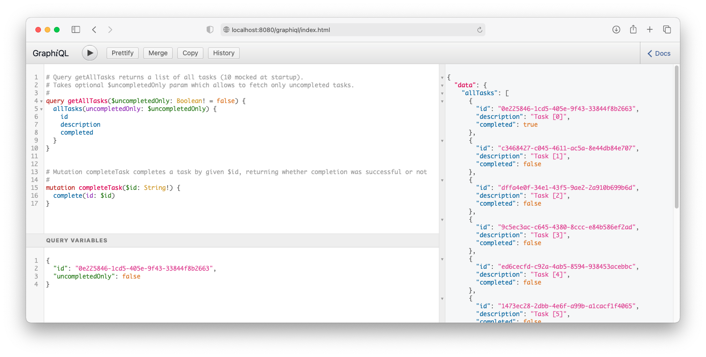
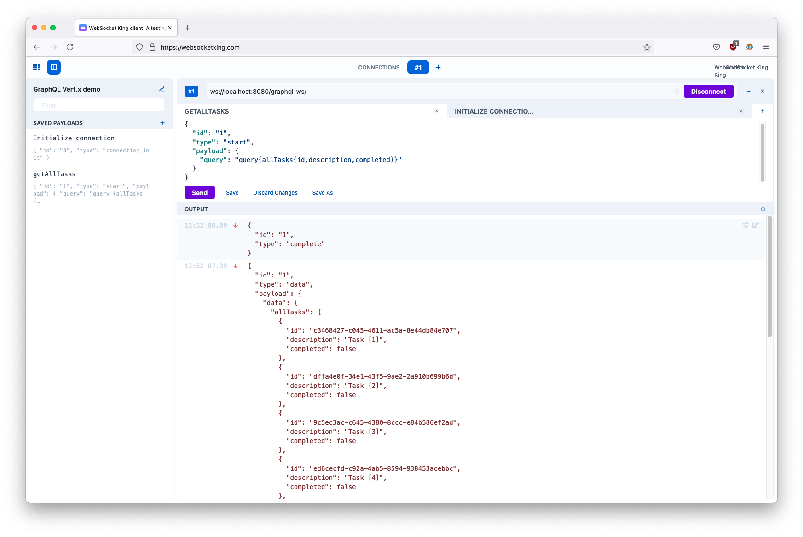

# GraphQL Vertx demo

This application is demo of __GraphQL__ with Vert.x. It was based on [Implementing a GraphQL server Vert.x how-to.](https://how-to.vertx.io/graphql-howto/)
In this project I've applied _hexagonal architecture_ described in [Allegro article.](https://blog.allegro.tech/2020/05/hexagonal-architecture-by-example.html)

## Starting application
To run this application you can use:
- `./gradlew run`,
- `GraphQL Application` service in IntelliJ.

## Endpoints:
- `http://localhost:8080/graphql` - main GraphQL HTTP endpoint,
- `ws://localhost:8080/graphql-ws` - main GraphQL WebSocket endpoint,
- `http://localhost:8080/grapihql/` - GraphiQL endpoint for GraphQL UI.

## Possible operations
For demo purposes, two operations were implemented:
```
# Query getAllTasks returns a list of all tasks (10 mocked at startup).
# Takes optional $uncompletedOnly param which allows to fetch only uncompleted tasks.
#
query getAllTasks($uncompletedOnly: Boolean! = false) {
  allTasks(uncompletedOnly: $uncompletedOnly) {
    id
    description
    completed
  }
}


# Mutation completeTask completes a task by given $id, returning whether completion was successful or not
#
mutation completeTask($id: String!) {
  complete(id: $id)
}
```

## Deployed application GraphiQL


## WebSocket connection
I was using [WebSocketKing](https://websocketking.com/) to test connection via WebSocket manually.

Steps to use GraphQL API over WebSocket:
1. You have to connect to `ws://localhost:8080/graphql-ws` - it should complete with `Connected to ws://localhost:8080/graphql-ws/` message.
2. After that, you have to initialize connection (as described in [GraphQL over WebSocket Protocol documentation](https://github.com/apollographql/subscriptions-transport-ws/blob/master/PROTOCOL.md))
to start communication with the server.
```json
{
  "id": "0",
  "type": "connection_init"
}
```

Server will respond with `Connection acknowledged` event:
```json
{
  "type": "connection_ack"
}
```

3. Last step is to perform GraphQL operations wrapped into `OperationMessage` object:
```json
{
  "id": "1",
  "type": "start",
  "payload": {
    "query": "query{allTasks{id,description,completed}}"
  }
}
```

Response events:
```json
{
  "id": "1",
  "type": "data",
  "payload": {
    "data": {
      "allTasks": [
        {
          "id": "c3468427-c045-4611-ac5a-8e44db84e707",
          "description": "Task [1]",
          "completed": false
        },
        {
          "id": "dffa4e0f-34e1-43f5-9ae2-2a910b699b6d",
          "description": "Task [2]",
          "completed": false
        },
        {
          "id": "9c5ec3ac-c645-4380-8ccc-e84b586ef2ad",
          "description": "Task [3]",
          "completed": false
        },
        {
          "id": "ed6cecfd-c92a-4ab5-8594-938453acebbc",
          "description": "Task [4]",
          "completed": false
        },
        {
          "id": "1473ec28-2dbb-4e6f-a99b-a1cacf1f4065",
          "description": "Task [5]",
          "completed": false
        },
        {
          "id": "5add1071-eb5d-4fcd-a4f0-e7c9963df7b6",
          "description": "Task [6]",
          "completed": false
        },
        {
          "id": "c971459e-cf6e-42ef-b038-30d6254e1dec",
          "description": "Task [7]",
          "completed": false
        },
        {
          "id": "207e1052-ed53-4391-b5a1-1b1c30573a74",
          "description": "Task [8]",
          "completed": false
        },
        {
          "id": "b13332ce-477e-4f61-a2c7-62b85f77626b",
          "description": "Task [9]",
          "completed": false
        }
      ]
    }
  }
}

{
  "id": "1",
  "type": "complete"
}
```



## Resources:
- https://how-to.vertx.io/graphql-howto/
- https://blog.allegro.tech/2020/05/hexagonal-architecture-by-example.html
- https://github.com/apollographql/subscriptions-transport-ws/blob/master/PROTOCOL.md
